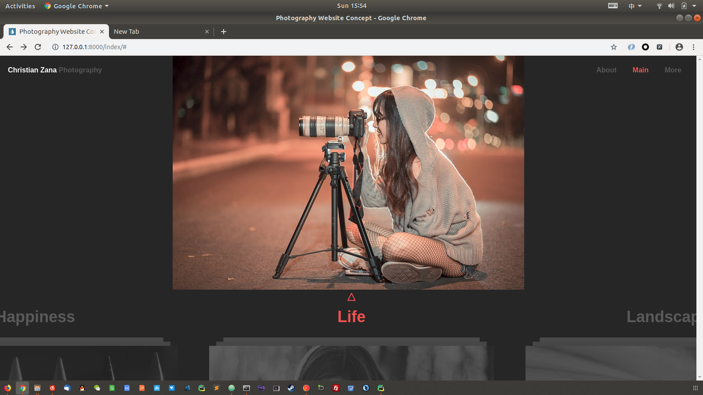
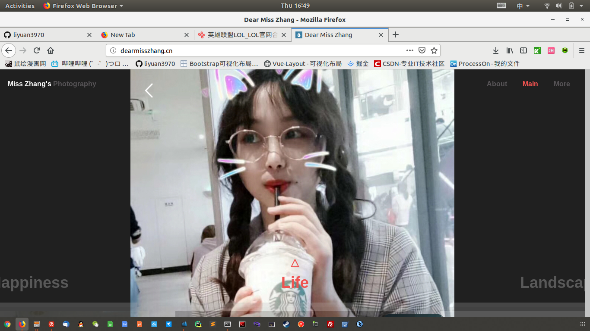
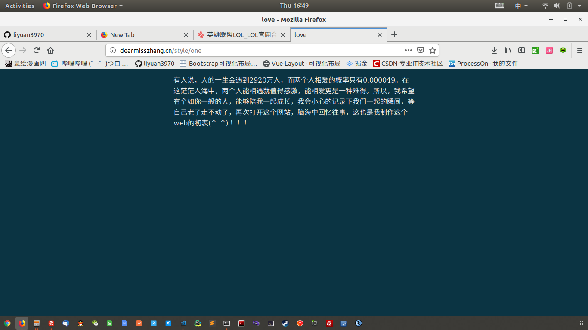

# Dear Miss Zhang
##　这是一个基于django mysql jquery 的项目,这个项目的是为了追一个内心善良，纯洁的小姐姐!　同时记录一个准程序员追妹子的过程！！不在乎失败，享受过程！总结经验，只为迎接更好的自己！这才是重要的！！
## 为什么选择web
将来找到了合适的妹子，能够用心去记录另一半的生活，年轻的小姑娘像一朵花，要呵护，而我将扮演一个树苗，成长，成熟，直到能够守护她。

## 所需要的库
1. pip install django==1.11.8
2. pip install pymysql
3. pip install pillow

## 所需要的软件
1. mysql
2. python （版本3以上，本人的是3.7）
3. pycharm(不想用也可以)


## 创建数据库

1. mysql -uroot -p  
2. create databases photo default charset=utf8;

## 数据库实体类
**总共有4个实体数据表，分别是landscpe、life、happniess、food**
### 四个数据表结构相似，如下：

| Field | Type         | Null | Key | Default | Extra          |
|-------|--------------|------|-----|---------|----------------|
| id    | int(11)      | NO   | PRI | NULL    | auto_increment |
| img   | varchar(100) | NO   |     | NULL    |                |
| time  | date         | NO   |     | NULL    |                |
| title | varchar(50)  | NO   |     | NULL    |                |


## 将项目跑起来

1. python manage.py makemigrations
2. python manage.py migrate
3. python manage.py createsuperuser
4. python manager.py runserver
5. ctul + C 结束项目

## 首页展示


# 项目部署
## 安装基本软件
1. nginx
   1. 安装：sudo apt-get install nginx
   2. 启动：sudo /etc/init.d/nginx restart
2. wusgi
   1. conda安装：conda install -c conda-forge uwsgi
   2. 常见错误：conda install -c conda-forge libiconv
   
## 部署uwsgi-->需要放到项目目录下--->phtot_uwsgi.ini
```cassandraql
[uwsgi]
#指定项目端口号，django默认是8000
http = :8000
# 指定uwsgi和nginx通信端口
socket=127.0.0.1:8001
# 指定项目路径
chdir=/home/liyuan3970/project/photo
# 指定wsgi.py路径
wsgi-file=photo/wsgi.py
# 进程数
processes=1
# 线程数
threads=2
# 指定本项目uwsgi自身占用端口
stats=127.0.0.1:8080
#vhost = true          //多站模式
#no-site = true        //多站模式时不设置入口模块和文件

```
## 配置nginx文件
1. sudo -i
2. cd /etc/nginx/sites-enabled/
3. vi project_nginx.conf
4. cp /etc/nginx/uwsgi_params /home/liyuan/project/photo
5. cd /etc/nginx/sites-enabled
6. vi default ##listen 800 default server将默认的端口改掉
7. /etc/init.d/nginx restart


```cassandraql
server{
	    # 监听本项目端口,浏览器输入的那个端口
	    listen 80;   
	    server_name www.dearmisszhang.cn;
	    charset utf-8;

	    # 收集项目静态文件路径
	    location /static{
		alias /home/liyuan3970/project/photo/collectstatic;
	    }

	    # 和uwsgi通信端口和通信文件
	    location /{
		# uwsgi_params文件拷贝到项目目录中
		include uwsgi_params;
		uwsgi_pass 127.0.0.1:8001;
	    }
	}

```
## 修改项目代码
1. 在settings.py中添加路径(STATIC_ROOT)
   1. 要和nginx配置文件中的路径一致
   2. STATIC_ROOT = '/home/liyuan3970/project/photo/collectstatic'

2. 收集静态文件
   1. python manage.py collectstatic
   
## 启动uwsgi-->在项目目录下
1. **uwsgi --ini photo_uwsgi.ini**

# 正式表白

## 520前一天
5.19更新日志：
1. 测试网络环境
2. 修改学校服务器，进行网络备用
3. 询问好友和师妹建议，
   1. 基友建议网速太慢，经过仔细排查，好像不在能力范围之内，测试环境下访问速度在３ｓ－４ｓ之内，还行吧
   2. 师妹建议，先把妹子约出来吃饭，在发这个网站，而且鉴于认识时间很短，不要说要不要做女朋友。－－－>这一点我也赞成，将表白页面的愿意改成了不要点。示意她不要点了！哈哈哈我真是聪明。
4. 测试ＢＵＧ，好像没有，上传图片的后台功能也不需要让她看到，所以即使这个地方的ＢＵＧ也不会影响首页的展示功能
## 2019年５月２０号
## 520更新日志：
等到了晚上６点，反复测试没有问题后，发给了她，虽然原本预期是晚上８点，但是实在等不急了，因为考虑到看到过她微信上的男孩子背景，所以考虑可能已经男朋友了，５５５５，想了１个小时怎么微信上回复，仔细思考了各种可能和回复方式，最后还是干脆表明自己怀疑可能得知了她有男朋友，就送她一个网站吧,看她怎么回复

# 妹子的回复:
1. 你追我是用心了，编程大佬你好（WTF？？？）
2. 没猿粪(女孩子都这么打字的？？？好臭啊！！)，我有男朋友了(果然！)
3. 有能力又幽默的男孩子会找到更好的！(哎。。)
4. 我可以帮你介绍对象（不知道程序员很专一吗，妈个鸡）
5. 我们虽然没戏，但是一定（用的是一定！！？？？）会成为好朋友（谁要和你做朋友，哼！）
# 我的回复:
1. 柴犬卖萌的表情包
2. 微信”机智“的表情包 
3. 放心啦

# 结论
自闭＋无奈＋脑子混乱＋惋惜－－－>死宅的第一次表白基本就是这样吧，唯一欣慰的是她说我用心了，也就是这个，行吧。。

# 成品部分展示
## 首页展示
**此版本对应version1.0分支**

## 表白页


# 总结：
这一次是失败了，没有提前打听好情报，但是这也是我的性格吧，想追就用心去追感觉没有问题！至于说失败．．．在所难免的，毕竟第一次，但是以后会胆大很多吧，即使没有表白成功，但是我依然觉得这个女孩子值得我这样费劲心思去争取，没有因为这一点后悔，只不过，我觉得自己可能追的太晚了，这一点算是学到了，如果再碰到喜欢的妹子，我依然会用心去追，只不过要抓紧！！！抓紧！抓紧！！那些个又漂亮有好的妹子真的太抢手了（５５５５５５）


# 更新日志
## 5月23日
## 更新背景：
1. 失败３天没睡好觉
2. 反复揣摩妹子心思，没有实质性的结论
3. 突然脑子一热，对妹子的话进行分析，和可能性分类，感觉自己又好像想通了

## 对于妹子的回复进行分情况讨论
1. 我是好人　－－－－－>这点略过，不解释
2. 没缘分　＆　有男朋友了
   1. 没缘分
      1. 她就是对我没兴趣
      2. 深深的喜欢他的那个男朋友，不考虑其人了
   1. 有男朋友了
      1. 男朋友在找工作之前？－－－－>妹子也专一，那么虽然不好追，但毕竟异地恋，机会有的！也有了继续追的动力！
      2. 男朋友在找工作之后？－－－－>妹子根本看不上你，醒醒吧，算了吧，这样的话，我果断退出！  
1. 帮我介绍对象－－－>她要是真敢，说明她善良，但我就问她那女的和她比怎么样！
2. 有能力又幽默的boy，一定会成为好朋友
   1. 被老夫的气质和用心所折服，给了一个台阶下，表示还是有机会的！！！
   2. 醒醒吧，我对你的好玩表示感兴趣，这种人都十分有趣，但我不想和你在一起

## 归类可以继续追的可能
1. **这个妹子找了一个外地的男朋友，她还爱着他，但是双方可能没法在一起了**
2. **这个妹子善良，喜欢我这种性格，真的愿意和我交朋友**

## 我需要怎么做
**这尼玛还用写吗？老子不服气啊，继续追！想通了！**
## 脑子过热之后
### 我需要怎么做？
1. 减肥吧，谁愿意找一个1７０的胖子！！
2. 后续工作中观察妹子，看她是不是符合可以追的条件
3. 继续完成这个项目，进一步重构代码，做一个功能完整的生活记录web
4. 进一步提升自己的学习能力，努力工作，增加创新能力，并证明自己的能力
5. 如果以上四条都做到了，追不到妹子也会有妹子倒追我的！大不了我把我的网站换下图片域名就好了！哼！！

## 2019年７月20日
距离去下属县局还有３天，出于好心，想要帮小姐姐搬东西，人家既然说了有男朋友了，所有以也只能示好而已了，一如既往的被拒绝了，之前都在猜测妹子的男朋友是在盐城，所以小姐姐是一个专一的人，我这么做其实真的也不能算好，但是这个“朋友”却很引起了我的兴趣，为什么会有人愿意帮小姐姐这么多的忙？（男生？想追她？），如果是这样的话，那她的那个盐城的男朋友？？真奇怪！
1. 如果她再有盐城的男朋友的条件下，还接受了这个朋友，那i quit
2. 如果她所谓的男朋友就是这个朋友，那i quit
3. 如果仅仅是朋友,关系好，那么我要等确定她找到了另一半再放弃

## 努力让自己更优秀，增加追到她的砝码，并保持观望吧！

