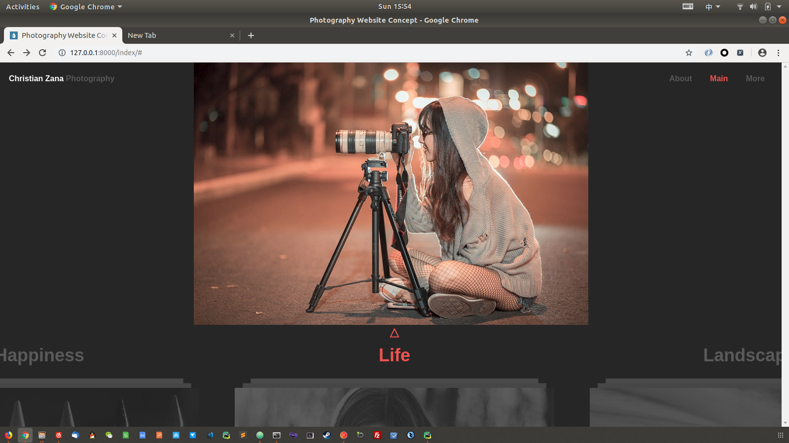

# 代码测试运行
##这是一个基于django mysql jquery 的项目

##所需要的库
1. pip install django==1.11.8
2. pip install pymysql
3. pip install pillow

##所需要的软件
1. mysql
2. python （版本3以上，本人的是3.7）
3. pycharm(不想用也可以)


##创建数据库

1. mysql -uroot -p  
2. create databases photo default charset=utf8;

##数据库实体类
**总共有4个实体数据表，分别是landscpe、life、happniess、food**
###四个数据表结构相似，如下：

| Field | Type         | Null | Key | Default | Extra          |
|-------|--------------|------|-----|---------|----------------|
| id    | int(11)      | NO   | PRI | NULL    | auto_increment |
| img   | varchar(100) | NO   |     | NULL    |                |
| time  | date         | NO   |     | NULL    |                |
| title | varchar(50)  | NO   |     | NULL    |                |


##将项目跑起来

1. python manage.py makemigrations
2. python manage.py migrate
3. python manage.py createsuperuser
4. python manager.py runserver
5. ctul + C 结束项目

##首页展示


#项目部署
##安装基本软件
1. nginx
   1. 安装：sudo apt-get install nginx
   2. 启动：sudo /etc/init.d/nginx restart
2. wusgi
   1. conda安装：conda install -c conda-forge uwsgi
   2. 常见错误：conda install -c conda-forge libiconv
   
##部署uwsgi-->需要放到项目目录下--->phtot_uwsgi.ini
```cassandraql
[uwsgi]
#指定项目端口号，django默认是8000
http = :8000
# 指定uwsgi和nginx通信端口
socket=127.0.0.1:8001
# 指定项目路径
chdir=/home/liyuan3970/project/photo
# 指定wsgi.py路径
wsgi-file=photo/wsgi.py
# 进程数
processes=1
# 线程数
threads=2
# 指定本项目uwsgi自身占用端口
stats=127.0.0.1:8080
#vhost = true          //多站模式
#no-site = true        //多站模式时不设置入口模块和文件

```
##配置nginx文件
1. sudo -i
2. cd /etc/nginx/sites-enabled/
3. vi project_nginx.conf
4. cp /etc/nginx/uwsgi_params /home/liyuan/project/photo
5. cd /etc/nginx/sites-enabled
6. vi default ##listen 800 default server将默认的端口改掉
7. /etc/init.d/nginx restart


```cassandraql
server{
	    # 监听本项目端口,浏览器输入的那个端口
	    listen 80;   
	    server_name www.dearmisszhang.cn;
	    charset utf-8;

	    # 收集项目静态文件路径
	    location /static{
		alias /home/liyuan3970/project/photo/collectstatic;
	    }

	    # 和uwsgi通信端口和通信文件
	    location /{
		# uwsgi_params文件拷贝到项目目录中
		include uwsgi_params;
		uwsgi_pass 127.0.0.1:8001;
	    }
	}

```
##修改项目代码
1. 在settings.py中添加路径(STATIC_ROOT)
   1.* 要和nginx配置文件中的路径一致
   2. STATIC_ROOT = '/home/liyuan3970/project/photo/collectstatic'

2. 收集静态文件
   1. python manage.py collectstatic
   
##启动uwsgi-->在项目目录下
**uwsgi --ini photo_uwsgi.ini**
